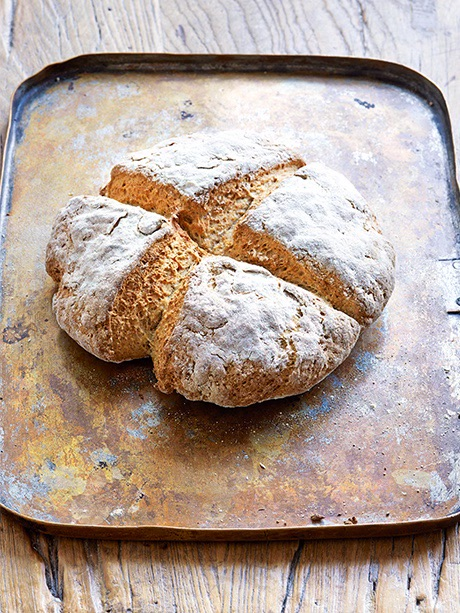

# Irish Soda bread

## Attribution

* *Date Added:* 2023-02-08
* *Title:* Irish Soda Bread

## Description

> Soda bread is a variety of quick bread traditionally made in a variety of cuisines in which sodium bicarbonate (otherwise known as "baking soda", or in Ireland, "bread soda") is used as a leavening agent instead of the traditional yeast. The ingredients of traditional soda bread are flour, baking soda, salt, and buttermilk. The buttermilk in the dough contains lactic acid, which reacts with the baking soda to form tiny bubbles of carbon dioxide. Other ingredients can be added, such as butter, egg, raisins, or nuts. An advantage of quick breads is their ability to be prepared quickly and reliably, without requiring the time-consuming skilled labor and temperature control needed for traditional yeast breads.

[read more](https://en.wikipedia.org/wiki/Soda_bread) on Wikipedia

## Ingredients

* 250g (9 oz) plain wholemeal flour
* 250g (9 oz) plain white flour
* 1 tsp bicarbonate of soda
* 1 tsp salt
* 420ml (15 fl oz) buttermilk
* extra flour for dusting

## Directions

1. Preheat the oven to 390F.
1. In a large bowl, mix together the two types of flour, bicarbonate of soda and salt.
1. Add the buttermilk and mix until a sticky dough forms.
1. Lightly flour a work surface and tip the dough onto it.
1. Gently roll and fold the dough a couple of times to bring the mixture together. Do not knead.
1. Shape the dough into a ball. Flatten the ball gently with your hand. Score the dough with a deep cross dividing it into quarters. Dust the bread with flour.
1. Place onto a baking tray lined with baking parchment and bake for 30 minutes at 390F. The loaf should be golden-brown.
1. Leave to cool on a wire rack. This is best eaten on the day of baking.
